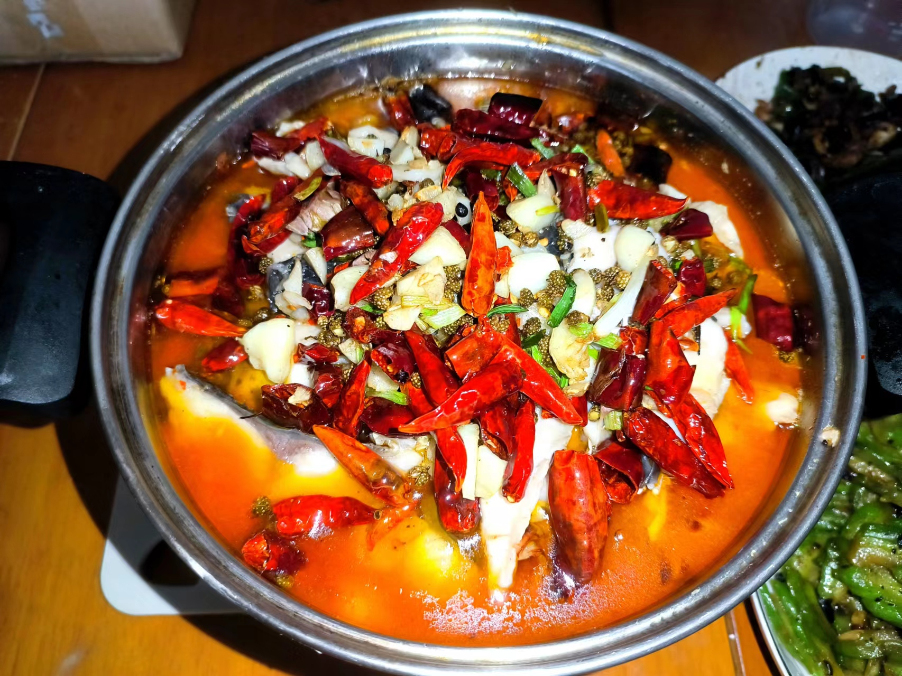
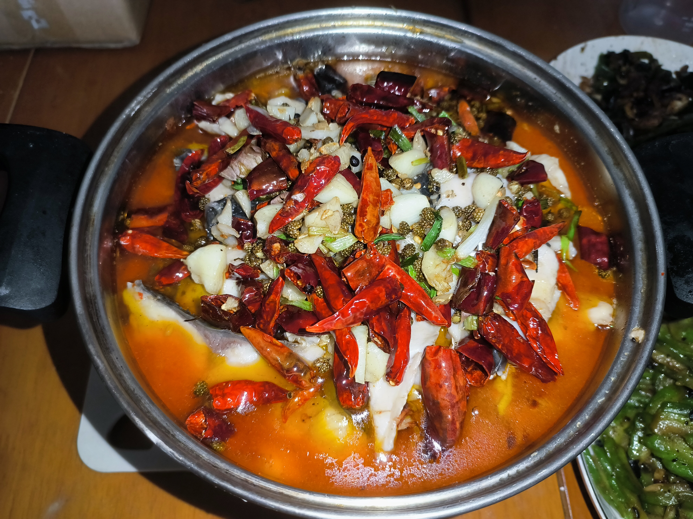

# 川菜-肥肠鱼
&nbsp;&nbsp;实践
1. 2022.07.03 ，味道还行(花椒辣椒差点意思)

## 材料准备
1. 肥肠(卤好的就行)
2. 草鱼一条
3. 干辣椒、蒜、花椒、火锅底料、葱、豆瓣酱

## 备菜
1. 肥肠切成小段
2. 将鱼骨剔下来，鱼肉片成片(大一点，不要太薄了)
3. 鱼肉放入盆中，加入两小勺盐，揉搓抓洗,抓洗两遍，再用清水洗净
   > 去除鱼肉的腥味
4. 控干水分
5. 将鱼肉放入盆中，加入一小勺盐，白胡椒粉，少许料酒，抓匀
6. 放入干淀粉，锁住水分
   > 生粉，红薯淀粉还没试过，应该不行，红薯淀粉放入应该会影响鱼片的口感

## 炒菜
1. 放入油，油热放入肥肠，将肥肠炒出油。
2. 放入蒜，放入鱼骨
3. 鱼骨炒至发黄，放入火锅底料，豆瓣酱,炒香，加入料酒去腥
4. 加入清水，放入盐，鸡精，胡椒粉调味，开锅煮几分钟
5. 加入喜欢的青菜，煮几分钟
6. 关火，捞出到盆中。
7. 捞出残渣
8. 开小火，放入鱼片,下鱼片时水不能沸腾，火不能太大，否则鱼片会老
   > 火候是关键，注意
9.  全部放进去之后，开中火，用勺子轻轻地推，再次开锅煮30秒鱼片变白就熟了。
10. 将鱼片放到盆中
11. 将干辣椒、花椒炒香，放入蒜末爆出香味，放入盆中。
12. 撒上葱花.

## 成品
1. 
2. 